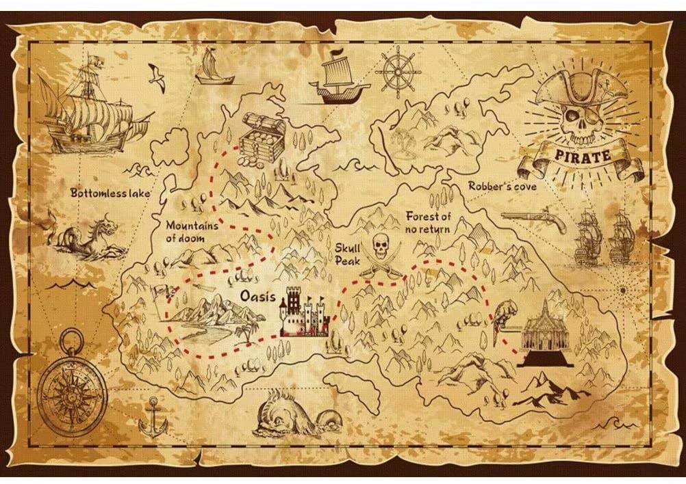

# bash-treasure-hunt
Text challenges to improve your command-line skills.

  

## Introduction

Join me on an action-packed adventure...

## How to play

Info... (put a code excerpt here)

## Plot

Info...

## Characters

Info...

  
   
  
  
  

