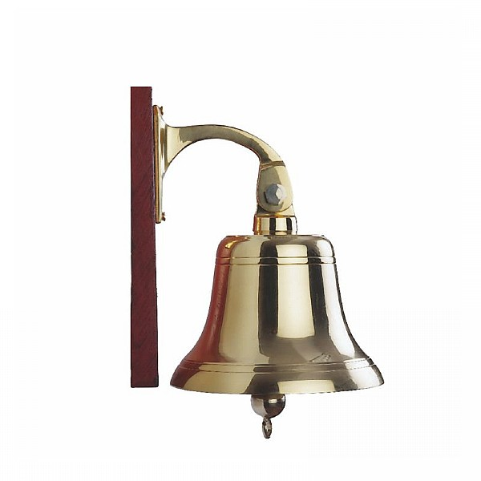

# Dog Watch

<br/><br/>

The Captain decides it's your turn to keep at watch at night and puts you on *First Dog Watch* starging tomorrow. "Don't worry" he says, "You'll know when it's your turn by the ringing of that bell" and heads off to his cabin for a nap. "But the bell rings all the time" you cry. "How do I know when I'm up next?". 

The current schedule looks something like this:

| Watch      | Hours |
| ----------- | ----------- |
| Middle Watch      | Midnight to 4 AM (0000 – 0400)       |
| Morning Watch   | 4 AM to 8 AM (0400 – 0800)        |
| Forenoon Watch   | 8 AM to Noon (0800 – 1200)        |
| Forenoon Watch   | Noon to 4 PM (1200 – 1600)        |
| Afternoon Watch   | 4 PM to 6 PM (1600 – 1800)        |
| First Dog Watch   | 4 PM to 6 PM (1600 – 1800)        |
| Second Dog Watch   | 6 PM to 8 PM (1800 – 2000)        |
| First Watch   | 8 PM to Midnight (2000 – 0000)        |

You spend the next day paying close attention to the bell-ringing and realise there's a pattern for telling the time.

## Challenge

You keep a note of bell rining throughout the day, whenever you get a chance. Although you don't manage to note down eveything, you realise they are run every half an hour and spot a pattern during the middle watch (the same is repeated for every other watch *except Dog Watches which are only 2 hours long*):

00:30 1 bell <br/>
01:30 2 bells, pause, 1 bell <br/>
03:00 2 bells, pause, 2 bells, pause, 2 bells <br/>
03:30 2 bells, pause, 2 bells, pause, 2 bells, pause, 1 bell <br/>

You ask one of the other sailors how Dog Watch works and he replies: **"At the end of First Dog Watch, only four bells are struck (as it's only 2 hours long you don't need any more), Second Dog Watch follows the same pattern as the rest until the last ring which is 8"**. 

That should be enough to get going and you quickly get to work building a script to work out what time it is.

Create a script `bell-time.sh` which takes 2 parameters: the name of the watch e.g. "middle" and the number of bells that have been rung e.g. 4 and output what the time is in 24hr clock.

```bash bell-time.sh middle 4```

Output: <br/>
```The time in 24hr clock is 0200 hours.```

**TODO - instructions for script/bash commands**

## References

https://www.boatsafe.com/watch-schedules-ships-bells/

