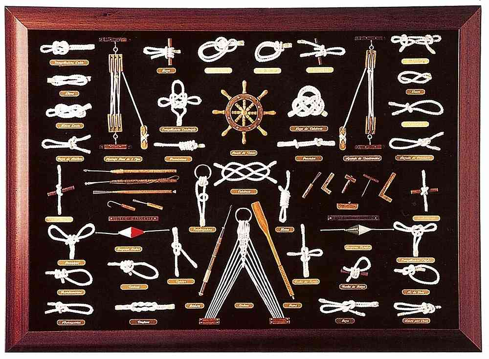

# Which knot is not the nautical knot?

  

Oh-oh, the Captian spots a problem. The main mast of the ship is looking particularly unstable. (He employed contractors to do some work on the ship and they were just "yes" men doing anything for money!). He asks you to *jury rig a temporary mast*, making sure you use the right knot. You better make sure you do a good job or you'll end up overboard!

## Challenge

Unfortunately you have no idea which knot is the correct one. So you sneak into the Captains cabin to see if he has a reference you can (ahem) copy and paste from, so to speak. Luckily you stumble across a guide on one of his shelves - "Knots Overflow" and flip through the pages. A quick-start at the front of the reference guide lists all the types of knots you might ever need, but unfortunately it's soiled and not legible. Maybe you can clean it up?

On closer expection, you realise that quite systematically, certain characters have been replaced with others:

**a** has been replaced with **@** 
**e** has been replaced with **&** 
**i** has been replaced with **\*** 
**o** has been replaced with **^** 
**u** has been replaced with **£** 

"Great!" you think. I can use `tr` for that.

- `tr` stands for translate and is used for replacing or removing specific characters in its input data set
- `|` (pipe) is used to input the output of one command into another
- `grep` is used to return matcing terms, and will print the whole line unless specified

Once you have worked out which knot to use, write it to your notebook (`echo`, `>>`) and move to the next level [TODO](TODO).

## References

https://linuxhint.com/bash_tr_command/#:~:text=tr%20command%20can%20be%20used%20with%20%2Dc%20option%20to%20replace,replace%20them%20by%20'a'.
