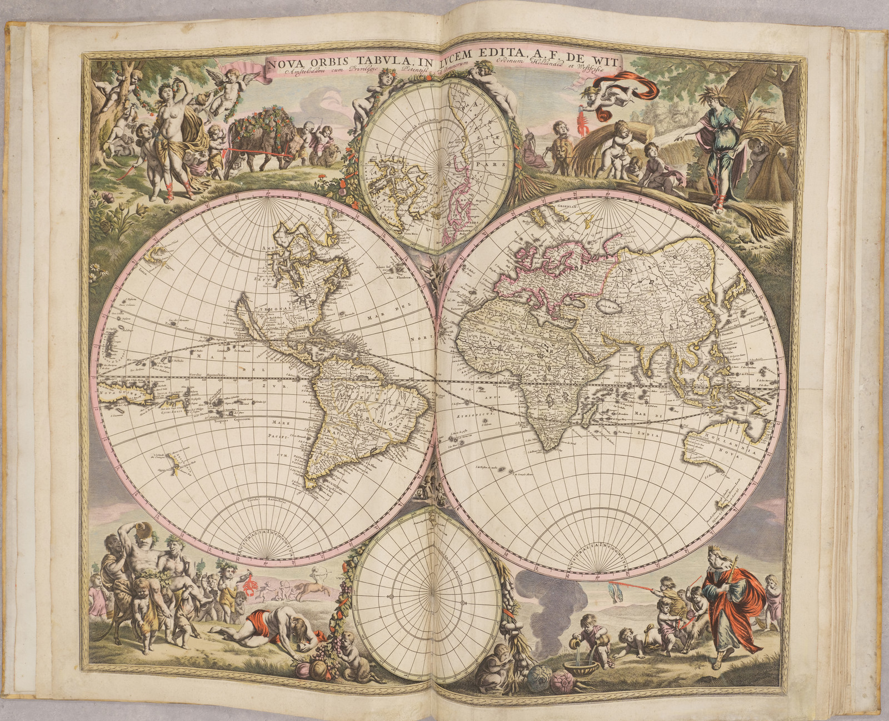

# Setting the Scene


<br/><br/>

It’s 1757 in Olde England and you are a penniless, destitute computer programmer who has just been evicted for not paying rent. While sitting in The Drunkards Arms, drowning your'e sorrows with your last shilling, a drunken sailor walks in and orders a rum and pineapple. As you are alone, he sits down in the chair opposite and and starts recounting tales of his latest adventures at sea: pirates, sharks and most interestingly, hidden treasure.  

The drunken sailor had a glance at a treasure map over the shoulder of a notorious pirate, but all he can remember was that the island country begins with an 'M', and has around 2000 square miles of land.

As you have no money and nothing else to do, going on a treasure hunt to find the missing treasure sounds like your best option, and the drunken sailor is happy to tag along. As you have nowhere to stay and the drunken sailor has become you new BFF, he offers you the floor of his room to sleep for the night.

## Challenge

<br/><br/>

You wake bright and early and decide to move forward starting at the beginning (`root`). While the drunken sailor is sleeping off his hangover, you grab your notebook and sneak out to the British library (`cd`) to do some investigative work. 

On arrival you head to the geography section (`cd`). It has a file listing the countries of the world and you quickly note the size with the long listing format (`ls -l`). Being the lazy programmer that you are, you think "I'm not reading all of that", and take a quick glance at the first five records (including the header).

```cat countries-of-the-world.csv | head -n 5```

- `cat` is used to concatenate files and/or print them to `stdout`
- `|` (pipe) is used to input the output of one command into another
- `head` lets you print only the first few lines of file (default 10 unless you specify with `-n <x>`)

You are thrilled to see the file has `Area (sq. mi.)` data and note the column.

You jump straight to the 'M' section (`grep`, `^`=start of file) and find the country with approximately 2000 square miles of land.

- `grep` is used to return matcing terms, and will print the whole line unless specified.
- the most basic example of this is `grep keyword filename`
- you can also do things like `grep <regex> filename`
- `^A` as the regex pattern will bring back all the rows which start with 'A'


Once you have worked out which country the treasure is buried, write it to your notebook (`echo`, `>>`) and move to the next level [The Docks](https://github.com/jspr19985/bash-treasure-hunt/blob/main/the-docks/README.md).

### Extra

You should be able to work out the country using the starting letter, and finding the n-th column which has the same area, but if you want to make it easier to read you can write the countries with the correct starting letter to a file (using redirect) and then the `cut` command to output just the columns you want.

## References

https://www.kaggle.com/fernandol/countries-of-the-world
