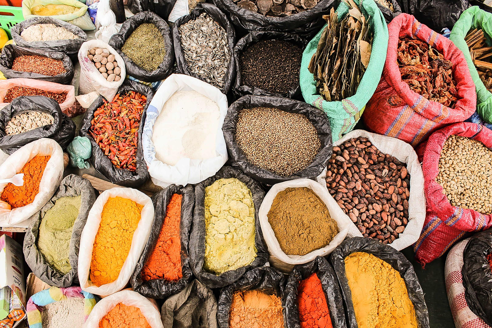

## Variety is the spice of life

  

As you are well on your way to the next port, the Capitain approaches you with a bit of a challenge. He's found out your are a computer programmer and wants you to work out a calculation for him using `bc` or `basic calculator`.

"Spices are an extremely important part of this voyage" he tells you. He is under strict instructions from the ruling Queen to bring back exciting herbs and spices to improve the taste of her Royal dinner table. In particular she is sick of pea and mint soup and quite fancies some saffron-infused paella. "We should be able to pick up some saffron when we stop in Morocco. Can you please work out how much we should pay for it?"

## Challenge

The captain has exchanged both mint and saffron for silk before (but has no more silk on board at the moment). You should be able to use it as a comparrison though.

0.44m of silk is worth 10G of mint  
62m of silk is worth 10G saffron

You have 100G of mint. How much saffron can you expect?

- you can work with `bc` interactively or by piping a value to it
- to work with decimal places you need to set the `scale`

## References

https://www.shell-tips.com/bash/math-arithmetic-calculation/
