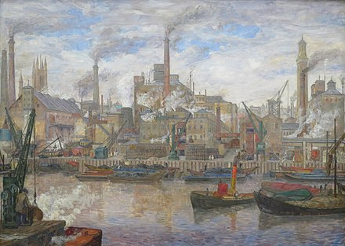
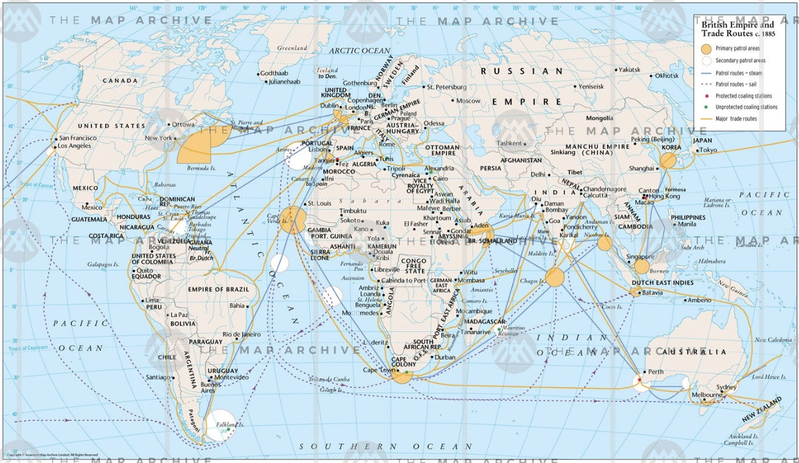

# The Docks

  

You rush back to the drunken sailor (`cd ../../`) to tell him the good news, that you've worked out which country the treasure is hidden. "Great!" he says, "Now all we have to do is get there - I believe it's a mere 6000 miles!". "Don't you have any friends with a boat who can take us there?" you ask. He suggests you can probably sneak onto a ship as a stowaway, you just need to find a ship going to the right destination.

## Challenge

  

The next day, you make your way to London Docks (`cd the-docks`), and the drunken sailor points out a cabin where you can find shipping maps, routes and schedules. You sneak in and find `trade-routes.csv` and `shipping-schedule.csv`. 

Use `trade-routes.csv` to find (`grep`) a trade route which includes the country you identified in level 1 (if you got the right country there should only be one). Then use the **final destination** of that route to find the ships, docks and day of departure from `shipping-schedule.csv`. Redirect (`>>`) the whole line into your `notebook.txt`.
