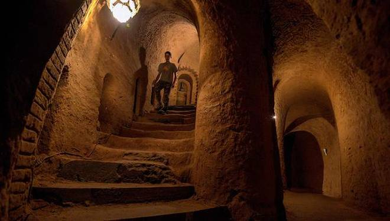
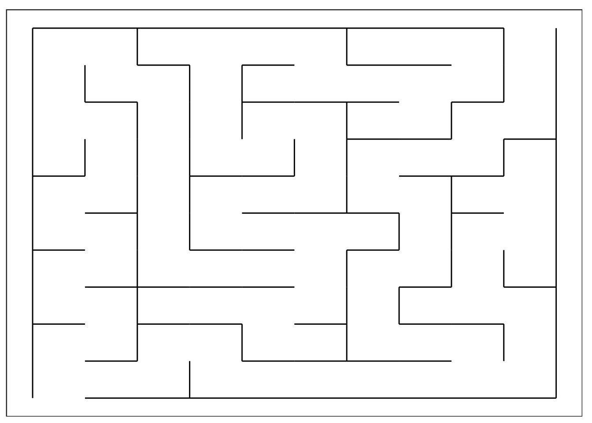

# Underground Maze

  

After escaping the blood-thirsty pirates, you make your way through the hidden latch in the floor, with the scroll tightly in your hand. As your eyes adjust to the darkness, you realise you are in an underground maze. Uh-oh, how do you find your way out of here? There must be a clue in the `ancient-scroll.txt`.

## Challenge

  

You `cat ancient-scroll.txt` and realise that if you replace a few of the letters, the words *OFDEQ* and *IBCQ* mean right and left respectively. Fortunately, you are quite adept with the `sed` command and use it to replace the words, writing the output to a new file. With the new file as a guide, you navigate your way through the maze `cd maze` to begin, following the path set out in the decrypted scroll. Right before you exit the maze, you notice a map drawn on the wall and you quickly snap a photo of it with your mobile `cp` and save it in a file `root/map.txt` for quick reference in the not too distant future.

- `sed` performs basic text manipulation (such as substitution) on files and input streams.
- basic format to replace text: `sed 's/foo/bar/' file.txt > new-file.txxt` replaces `foo` with `bar`
- multiple substitutions are semi-colon delimited e.g. `'s/foo/bar/ ; s/another/replacement/'`
- `cp` lets you copy files `cp somewhere/foo.txt somewhere-else/bar.txt`
